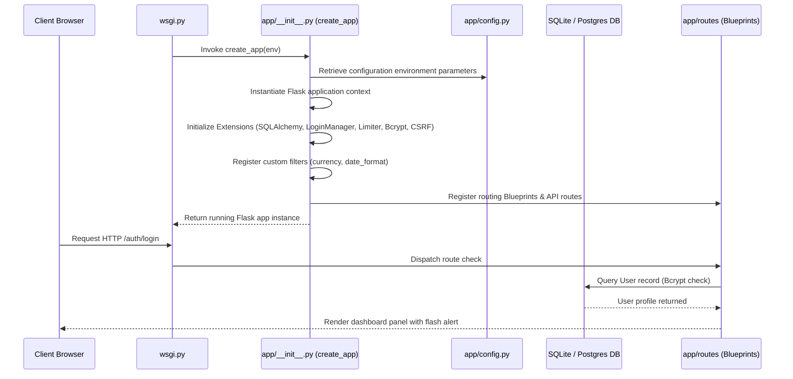

# Flavors Ledger - Detailed Code Walkthrough

This document outlines the detailed architectural blueprints and execution flow of the **Restaurant Revenue Tracking Application**.

---

## 🚀 1. The Startup & Request Lifecycle Flow

Here is how the application initializes and handles a client request, starting from the entry point:

### Execution Step-by-Step:
1. **WSGI Gateway ([wsgi.py](file:///C:/Users/BOTTE%20SAKETH%20YADAV/.gemini/antigravity-ide/scratch/restaurant_revenue_tracker/wsgi.py))**:
   - The server boots. It reads `FLASK_ENV` from environment variables, defaults to `'development'`, and calls `create_app(env)` to initialize the application instance.
2. **App Factory Setup ([app/\_\_init\_\_.py](file:///C:/Users/BOTTE%20SAKETH%20YADAV/.gemini/antigravity-ide/scratch/restaurant_revenue_tracker/app/__init__.py))**:
   - Configures application parameters from `config.py`.
   - Initializes database, migration, authorization, CSRF security, bcrypt hashing, and rate limiting engines.
   - Sets up custom Jinja2 template filters for displaying Indian rupees (e.g. `₹1,25,000.00`) and timezones in IST.
   - Registers all views blueprints and `/api/v1/` RESTful routes.
3. **User Authentication & Session Management**:
   - Uses `login_manager.user_loader` callback to resolve the logged-in user context via `db.session.get(User, id)`.

---

## 📂 2. Detailed Codebase Walkthrough

### 2.1 Configuration & Extensions
- **[config.py](file:///C:/Users/BOTTE%20SAKETH%20YADAV/.gemini/antigravity-ide/scratch/restaurant_revenue_tracker/app/config.py)**:
  - Defines `Config` configurations. Exposes distinct properties for `DevelopmentConfig`, `TestingConfig` (which disables CSRF tokens to facilitate unit test requests), and `ProductionConfig` (enforcing PostgreSQL and strict cookies).
- **[extensions.py](file:///C:/Users/BOTTE%20SAKETH%20YADAV/.gemini/antigravity-ide/scratch/restaurant_revenue_tracker/app/extensions.py)**:
  - Declares core objects: `db` (SQLAlchemy), `migrate` (Alembic migrations), `login_manager` (user login sessions), `csrf` (WTForms protection), `bcrypt` (password hashing), and `limiter` (rate-limiter configured with `memory://` to suppress terminal warnings).

---

### 2.2 Database Models ([app/models/](file:///C:/Users/BOTTE%20SAKETH%20YADAV/.gemini/antigravity-ide/scratch/restaurant_revenue_tracker/app/models/))
All models are defined with SQLAlchemy ORM and structured to keep records isolated:

1. **[Branch](file:///C:/Users/BOTTE%20SAKETH%20YADAV/.gemini/antigravity-ide/scratch/restaurant_revenue_tracker/app/models/branch.py)**:
   - Represents physical restaurant locations (e.g. "Connaught Place"). Keeps tables, orders, inventory purchases, and cash flows scoped per branch.
2. **[User](file:///C:/Users/BOTTE%20SAKETH%20YADAV/.gemini/antigravity-ide/scratch/restaurant_revenue_tracker/app/models/user.py)**:
   - Staff credentials and system access flags. Role property defines authorization levels: `owner`, `branch_manager`, or `biller`. Password hashes are managed via bcrypt.
3. **[MenuItem](file:///C:/Users/BOTTE%20SAKETH%20YADAV/.gemini/antigravity-ide/scratch/restaurant_revenue_tracker/app/models/menu.py)**:
   - Food dishes. Categorized by starters, mains, breads, desserts, and drinks. Contains a boolean flag for vegetarian items and availability flags.
4. **[RestaurantTable](file:///C:/Users/BOTTE%20SAKETH%20YADAV/.gemini/antigravity-ide/scratch/restaurant_revenue_tracker/app/models/table.py)**:
   - Physical table logs containing table numbers, seating capacities, and active state tracking (`available`, `occupied`, or `reserved`).
5. **[Order](file:///C:/Users/BOTTE%20SAKETH%20YADAV/.gemini/antigravity-ide/scratch/restaurant_revenue_tracker/app/models/order.py)** & **[OrderItem](file:///C:/Users/BOTTE%20SAKETH%20YADAV/.gemini/antigravity-ide/scratch/restaurant_revenue_tracker/app/models/order.py)**:
   - Active ticket management. Represents the list of ordered food quantities, item pricing, and kitchen notes ("mild spice", etc.). Linked to specific table numbers.
6. **[Bill](file:///C:/Users/BOTTE%20SAKETH%20YADAV/.gemini/antigravity-ide/scratch/restaurant_revenue_tracker/app/models/bill.py)**:
   - Inflow sales records. Generated when tables settle their tabs. Logs subtotals, GST tax, discounts, final totals, payment mode, dates, times, and cashier details.
7. **[GroceryCategory](file:///C:/Users/BOTTE%20SAKETH%20YADAV/.gemini/antigravity-ide/scratch/restaurant_revenue_tracker/app/models/grocery.py)** & **[GroceryItem](file:///C:/Users/BOTTE%20SAKETH%20YADAV/.gemini/antigravity-ide/scratch/restaurant_revenue_tracker/app/models/grocery.py)**:
   - Stock profiles mapping 50+ ingredients (milk, paneer, tomatoes, flour, chicken) to specific measurement units (kg, liters, counts).
8. **[GroceryPurchase](file:///C:/Users/BOTTE%20SAKETH%20YADAV/.gemini/antigravity-ide/scratch/restaurant_revenue_tracker/app/models/grocery.py)**:
   - Outflow procurement logs tracking ingredient supplies purchases (quantities, unit costs, total spent, vendor name).
9. **[ExpenseCategory](file:///C:/Users/BOTTE%20SAKETH%20YADAV/.gemini/antigravity-ide/scratch/restaurant_revenue_tracker/app/models/expense.py)** & **[Expense](file:///C:/Users/BOTTE%20SAKETH%20YADAV/.gemini/antigravity-ide/scratch/restaurant_revenue_tracker/app/models/expense.py)**:
   - Outflow logs tracking general operational expenses (Rent, Utilities, Maintenance, Crockery) with invoice receipt numbers.
10. **[Employee](file:///C:/Users/BOTTE%20SAKETH%20YADAV/.gemini/antigravity-ide/scratch/restaurant_revenue_tracker/app/models/employee.py)** & **[SalaryPayment](file:///C:/Users/BOTTE%20SAKETH%20YADAV/.gemini/antigravity-ide/scratch/restaurant_revenue_tracker/app/models/employee.py)**:
    - Staff files containing base monthly salary structures. Tracks payouts with separate fields for bonuses, deductions, and payment methods.

---

### 2.3 Decoupled Services Layer ([app/services/](file:///C:/Users/BOTTE%20SAKETH%20YADAV/.gemini/antigravity-ide/scratch/restaurant_revenue_tracker/app/services/))
Houses core transactional operations:

- **[BillingService](file:///C:/Users/BOTTE%20SAKETH%20YADAV/.gemini/antigravity-ide/scratch/restaurant_revenue_tracker/app/services/billing_service.py)**:
  - `create_order(...)`: Allocates an active order to a table, changing its status to `occupied`.
  - `update_order_item(...)`: Adds, updates quantities, or deletes order items from the table's cart.
  - `calculate_order_totals(...)`: Calculates subtotals, applies item-level GST tax rates (e.g. 5% on starters, 18% on beverages), applies discounts, and returns the final checkout total.
  - `generate_bill(...)`: Finalizes orders, sets table state back to `available`, creates the `Bill` invoice ledger, and commits to the database.
- **[ExpenseService](file:///C:/Users/BOTTE%20SAKETH%20YADAV/.gemini/antigravity-ide/scratch/restaurant_revenue_tracker/app/services/expense_service.py)**:
  - Handles validation constraints and aggregates daily and monthly expenditures on grocery purchases, utilities, and employee payroll.
- **[ReportService](file:///C:/Users/BOTTE%20SAKETH%20YADAV/.gemini/antigravity-ide/scratch/restaurant_revenue_tracker/app/services/report_service.py)**:
  - `get_cashflow_summary(...)`: Computes total sales inflows vs total expenses outflows to return net monthly margins.
  - `get_monthly_profit_loss(...)`: Compiles full Profit & Loss parameters (Gross Sales, Cost of Goods Sold, Gross Profit, and OPEX) to calculate net pre-tax profit margins.

---

### 2.4 Security & Form Validations ([app/forms/](file:///C:/Users/BOTTE%20SAKETH%20YADAV/.gemini/antigravity-ide/scratch/restaurant_revenue_tracker/app/forms/))
- WTForms handle form rendering and server-side validation.
- Includes checks such as `validate_username` and `validate_email` in `auth_forms.py` to prevent duplicate accounts.
- Enforces strict input validation on numeric fields (e.g., salary, expense amounts, grocery quantities) to prevent negative values.

---

### 2.5 Blueprints & REST APIs ([app/routes/](file:///C:/Users/BOTTE%20SAKETH%20YADAV/.gemini/antigravity-ide/scratch/restaurant_revenue_tracker/app/routes/))
- **[auth.py](file:///C:/Users/BOTTE%20SAKETH%20YADAV/.gemini/antigravity-ide/scratch/restaurant_revenue_tracker/app/routes/auth.py)**: Handles staff logins, session logouts, and user profile page registers.
- **[billing.py](file:///C:/Users/BOTTE%20SAKETH%20YADAV/.gemini/antigravity-ide/scratch/restaurant_revenue_tracker/app/routes/billing.py)**: POS user flows (viewing table grids, taking orders, processing checkouts, and rendering printable receipts).
- **[dashboard.py](file:///C:/Users/BOTTE%20SAKETH%20YADAV/.gemini/antigravity-ide/scratch/restaurant_revenue_tracker/app/routes/dashboard.py)**: Resolves user roles to render specialized dashboards.
- **[employees.py](file:///C:/Users/BOTTE%20SAKETH%20YADAV/.gemini/antigravity-ide/scratch/restaurant_revenue_tracker/app/routes/employees.py)**: Management paths for employee profiles, staff listings, and processing salary payouts. Includes modern Bulk Onboarding grid forms.
- **[expenses.py](file:///C:/Users/BOTTE%20SAKETH%20YADAV/.gemini/antigravity-ide/scratch/restaurant_revenue_tracker/app/routes/expenses.py)**: Routes for logging utilities, renting, and ingredients inventory via Bulk Entry matrices.
- **[menu.py](file:///C:/Users/BOTTE%20SAKETH%20YADAV/.gemini/antigravity-ide/scratch/restaurant_revenue_tracker/app/routes/menu.py)**: CRUD pages to manage food catalog pricing and availability toggles using Bulk Add forms.
- **[reports.py](file:///C:/Users/BOTTE%20SAKETH%20YADAV/.gemini/antigravity-ide/scratch/restaurant_revenue_tracker/app/routes/reports.py)**: Financial logs rendering consolidated opex reports, cash flow tables, and monthly P&L sheets.
- **[chat.py](file:///C:/Users/BOTTE%20SAKETH%20YADAV/.gemini/antigravity-ide/scratch/restaurant_revenue_tracker/app/routes/chat.py)**: Manages the AI Command Center page and the API endpoints (e.g., `/chat/api/message`) that service both the dedicated UI and the floating assistant widget.
- **[api/v1/](file:///C:/Users/BOTTE%20SAKETH%20YADAV/.gemini/antigravity-ide/scratch/restaurant_revenue_tracker/app/routes/api/v1/)**:
  - Exposes RESTful JSON endpoints (e.g. `/api/v1/billing/order/<id>/update-item`) to feed live data updates to AJAX elements on the frontend without requiring page reloads.

---

### 2.6 Interactive Client Scripts ([app/static/js/](file:///C:/Users/BOTTE%20SAKETH%20YADAV/.gemini/antigravity-ide/scratch/restaurant_revenue_tracker/app/static/js/))
- **[billing.js](file:///C:/Users/BOTTE%20SAKETH%20YADAV/.gemini/antigravity-ide/scratch/restaurant_revenue_tracker/app/static/js/billing.js)**:
  - Manages POS cart interactions. Listens for menu item clicks, triggers asynchronous updates to the backend API, re-renders the cart list, and updates subtotals, taxes, and grand totals dynamically.
- **[charts.js](file:///C:/Users/BOTTE%20SAKETH%20YADAV/.gemini/antigravity-ide/scratch/restaurant_revenue_tracker/app/static/js/charts.js)**:
  - Interacts with Chart.js to render daily sales trajectory graphs and doughnut charts for opex categories, styled specifically to match the warm ivory light theme.

---

### 2.7 HTML Templates ([app/templates/](file:///C:/Users/BOTTE%20SAKETH%20YADAV/.gemini/antigravity-ide/scratch/restaurant_revenue_tracker/app/templates/))
- **[base.html](file:///C:/Users/BOTTE%20SAKETH%20YADAV/.gemini/antigravity-ide/scratch/restaurant_revenue_tracker/app/templates/base.html)**: Main HTML scaffold containing sidebar panels, flash notifications, and the global Floating AI Assistant Widget injection point.
- **[dashboard/](file:///C:/Users/BOTTE%20SAKETH%20YADAV/.gemini/antigravity-ide/scratch/restaurant_revenue_tracker/app/templates/dashboard/)**: Contains dashboards tailored to specific user roles.
- **[billing/](file:///C:/Users/BOTTE%20SAKETH%20YADAV/.gemini/antigravity-ide/scratch/restaurant_revenue_tracker/app/templates/billing/)**: POS templates, payment forms, and printable invoice layouts.
- **[expenses/](file:///C:/Users/BOTTE%20SAKETH%20YADAV/.gemini/antigravity-ide/scratch/restaurant_revenue_tracker/app/templates/expenses/)**: Logs for groceries, categories, and general expenditures via dynamic bulk entry tables.
- **[employees/](file:///C:/Users/BOTTE%20SAKETH%20YADAV/.gemini/antigravity-ide/scratch/restaurant_revenue_tracker/app/templates/employees/)**: Staff rosters and dynamic bulk onboarding forms.
- **[reports/](file:///C:/Users/BOTTE%20SAKETH%20YADAV/.gemini/antigravity-ide/scratch/restaurant_revenue_tracker/app/templates/reports/)**: Dynamic P&L spreadsheets and cash flow matrices.
- **[chat/](file:///C:/Users/BOTTE%20SAKETH%20YADAV/.gemini/antigravity-ide/scratch/restaurant_revenue_tracker/app/templates/chat/)**: The full-screen AI Command Center with suggestion chips and an insights library.

---

### 2.8 AI Services Layer ([app/services/ai/](file:///C:/Users/BOTTE%20SAKETH%20YADAV/.gemini/antigravity-ide/scratch/restaurant_revenue_tracker/app/services/ai/))
The generative AI backend powered by LangChain and OpenAI models, enabling text-to-SQL functionality and data visualization:
- **[engine.py](file:///C:/Users/BOTTE%20SAKETH%20YADAV/.gemini/antigravity-ide/scratch/restaurant_revenue_tracker/app/services/ai/engine.py)**: Instantiates the `RestaurantAgent`. It bridges the LangChain `SQLDatabase` toolkit with the active Flask-SQLAlchemy connection engine, orchestrating queries and returning AI responses.
- **[prompts.py](file:///C:/Users/BOTTE%20SAKETH%20YADAV/.gemini/antigravity-ide/scratch/restaurant_revenue_tracker/app/services/ai/prompts.py)**: Holds the master `RESTAURANT_SYSTEM_PROMPT`, which enforces Indian Rupee (₹) formatting and database schema awareness.
- **[chart_tool.py](file:///C:/Users/BOTTE%20SAKETH%20YADAV/.gemini/antigravity-ide/scratch/restaurant_revenue_tracker/app/services/ai/chart_tool.py)**: Implements custom LangChain tools allowing the LLM to autonomously generate Vega-Lite chart specifications based on database results.
- **[llm_instances.py](file:///C:/Users/BOTTE%20SAKETH%20YADAV/.gemini/antigravity-ide/scratch/restaurant_revenue_tracker/app/services/ai/llm_instances.py)**: A centralized configuration dictionary providing pre-initialized ChatOpenAI model instances for the agent.
